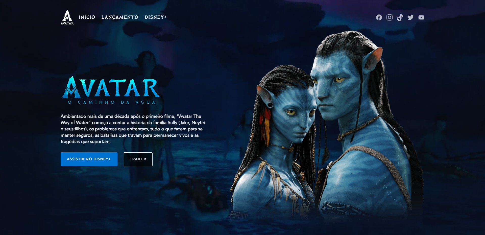

<h1 align="center">
  Landing Page - Avatar: O Caminho da Água
</h1>

## 📷 Deploy

<h3>LINK: https://lp-avatar.vercel.app/</h3>

## 💻 Projeto

Projeto próprio, onde consegui aplicar os conceitos de HTML e CSS para a criação de uma Landing Page do filme Avatar: O Caminho da Água.

## 🚀 Tecnologias

- HTML
- CSS

## 📔 Conhecimentos utilizados

- [x] Uso semântico do HTML
- [x] Uso do CSS Flexbox
- [x] Animações com a biblioteca [AOS]
- [x] Váriaveis do css no `:root`
- [x] Carregamento de vídeo no background
